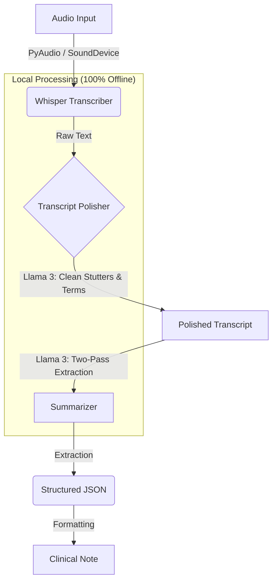

# GI Scribe Architecture

**GI Scribe** is a local-first, AI-powered medical dictation and summarization tool explicitly fine-tuned for Gastroenterologists. It records patient encounters, transcribes audio, contextually corrects terminology, and generates deeply structured clinical notes.

## High-Level Pipeline

The system processes audio through a robust 3-stage pipeline to ensure maximum clinical accuracy and zero-hallucination safety.

## Core Backend Components

### 1. Transcriber (`app/transcriber.py`)
*   **Engine:** `whisper.cpp` (C++ implementation for extreme edge optimization).
*   **Model:** `large-v3` (Quantized for performance/accuracy balance).
*   **Execution:** Runs async via computationally heavy CLI subprocess to avoid GIL blocking the main application UI thread.

### 2. Transcript Polisher (`app/transcript_polisher.py`)
*   **Engine:** `medllama3` (Llama 3 zero-shot prompted for medical context) via Ollama.
*   **Goal:** "Verbatim Correction".
*   **Logic:**
    *   Takes raw whisper output that may contain severe phonetic errors (e.g. "womiting").
    *   Corrects misspelled medical terms while strictly avoiding summarizing early.
    *   **Input:** "Patient has womiting and... uh... pain."
    *   **Output:** "Patient has vomiting and... uh... pain."

### 3. Summarizer (`app/two_pass_summarizer.py`)
*   **Engine:** `medllama3` via Ollama.
*   **Strategy:** "Divide and Conquer" logic loop.
    *   **Pass 1 (Extraction):** Identifies clinical entities (Symptoms, Meds, History).
    *   **Pass 2 (Synthesis):** Formats extraction into a standardized medical note (HPI, Findings, Assessment, Plan).

## Presentation Layer (UI Modules)

To maintain a professional, testable, and maintainable codebase, the User Interface (PySide6) is modularized under the `app/ui/` directory:

*   **`main_window.py`**: The central `MedRecWindow` class that handles high-level layout routing and threading integration.
*   **`components.py`**: Extracted functional UI widgets (e.g., `AnimatedMicWidget`, `RecordingCard` and `FolderCard`), preventing UI code bloat in the main window.
*   **`styles.py`**: A centralized repository of Qt Style Sheets (QSS) for a beautiful, clinical, unified application aesthetic. Includes complex dark mode styling and dynamic animations.

## Data Storage Strategy

All PHI boundaries are guarded strictly within `root/local_storage/`.
*   `sessions/`: Houses Metadata (`.json`), source Audio (`.wav`), and output Texts.
*   **Error Tolerance**: Graceful degradations and catch-alls ensure disk-write failures do not unexpectedly terminate the application loop. 
*   **Retention:** Fully autonomous lifecycle management that natively enforces HIPAA-style local deletion policies (configurable 90-day defaults).
