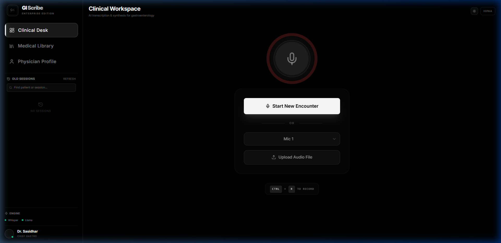
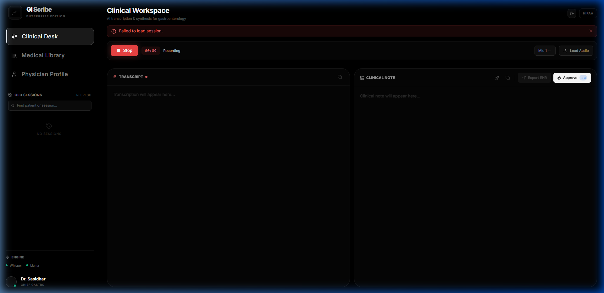
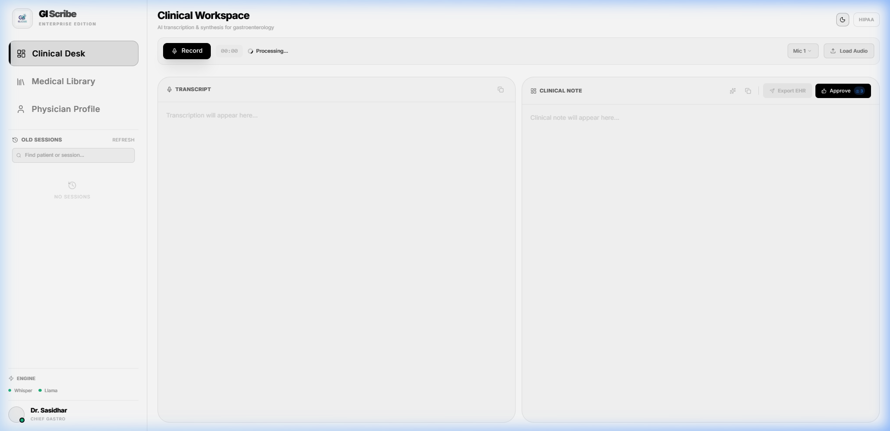

# GI Scribe

**AI-Powered Clinical Dictation Assistant for Gastroenterology**

[](https://python.org)
[](https://nextjs.org)
[](https://fastapi.tiangolo.com)
[](LICENSE)
[](#-privacy--hipaa-compliance)

---

GI Scribe is a **local-first, privacy-preserving** clinical documentation assistant. It records patient encounters, transcribes audio with medical-grade accuracy, and generates structured clinical notes — all running **100% offline** on your hardware.

## 🖥️ Workspace Preview

**Interactive "Ready to Scribe" Console:** Beautiful Framer Motion interpolating dashboard with pulsing mic detection.


**Live Inferencing:** Real-time percentage tracking for the NLP ingestion pipeline directly in the recording bar.


**High-Contrast Theming:** One-click Light Mode inversion for brightly lit clinic environments without degrading layout structure.


## ✨ Features

| Feature | Description |
|---------|-------------|
| **🎙️ Live Dictation** | Record directly from your microphone with real-time transcription |
| **📋 Clinical Notes** | Auto-generated HPI, Assessment, Plan, Medications, and Follow-up sections |
| **🧠 Self-Learning** | Adapts to your writing style from corrections — progressively better notes |
| **🔒 100% Offline** | No cloud, no telemetry, no data leaves your machine |
| **⚡ GPU-Accelerated** | Optimized for NVIDIA GPUs with BFloat16/Float16 precision |

## 🏗️ Architecture

```
┌─────────────────────────────────────────────────────────┐
│                    Next.js Frontend                      │
│         (Dashboard · Library · Profile)                  │
├─────────────────────────────────────────────────────────┤
│                    FastAPI Backend                        │
│          REST API + WebSocket (port 8000)                │
├──────────┬──────────────┬───────────────┬───────────────┤
│ Whisper  │  Ollama/Llama│  Preference   │   SQLite DB   │
│ L-v3     │  Summarizer  │  Learner      │   (medrec.db) │
└──────────┴──────────────┴───────────────┴───────────────┘
```

**Three-Stage Pipeline:**
1. **Transcribe** — Whisper Large-v3 (faster-whisper / CTranslate2)
2. **Correct** — Clinical Acoustic Corrector via Llama 3.1
3. **Summarize** — Two-pass structured note generation with self-learning

## 📊 Accuracy

| Metric | Result |
|--------|--------|
| Average WER | **1.91%** |
| Peak Accuracy | **98.83%** |
| Clinical Integrity | **Verified** — zero hallucinations |

> Benchmarked on GAS0001-GAS0027 (GI Audio Scenarios) with ambient clinic noise injection.

## 🚀 Quick Start

### Prerequisites

- **Python 3.11+**
- **Node.js 18+**
- **NVIDIA GPU** with CUDA (recommended: RTX 3060 12GB+)
- **[Ollama](https://ollama.com)** with `llama3.1` model

### 1. Clone & Setup Python

```bash
git clone https://github.com/Sasidhar-7302/GI_Scribe.git
cd GI_Scribe

python -m venv .venv
# Windows
.venv\Scripts\activate
# macOS/Linux
source .venv/bin/activate

pip install -r requirements.txt
```

### 2. Setup Ollama

```bash
ollama pull llama3.1
ollama serve        # Keep running in background
```

### 3. Configure

```bash
cp config.example.json config.json
# Edit config.json with your GPU and model paths
```

### 4. Setup Frontend

```bash
cd frontend
npm install
```

### 5. Run

**Option A — Development (two terminals):**

```bash
# Terminal 1: Backend
uvicorn app.api:app --host 127.0.0.1 --port 8000

# Terminal 2: Frontend
cd frontend && npm run dev
```

**Option B — Unified launcher:**

```bash
python main_web.py
```

Open **http://localhost:3000** in your browser.

## 🔒 Privacy & HIPAA Compliance

GI Scribe is designed as a **zero-cloud** application:

- **100% Local Inference** — Whisper and Llama run entirely on your GPU
- **PHI Isolation** — Patient data stays in `local_storage/`, excluded from git
- **No Telemetry** — Zero background trackers, crash reports, or analytics
- **Data Retention** — Configurable auto-cleanup (default: 90 days)
- **No Internet Required** — Works in air-gapped environments

## 📂 Project Structure

```
GI_Scribe/
├── app/                    # Python backend
│   ├── api.py              # FastAPI REST + WebSocket endpoints
│   ├── transcriber.py      # Whisper integration
│   ├── two_pass_summarizer.py  # Clinical note generation
│   ├── preference_learner.py   # Self-learning engine
│   ├── database.py         # SQLite manager
│   └── prompt_templates.py # Clinical prompt engineering
├── frontend/               # Next.js web interface
│   ├── src/
│   │   ├── app/            # Next.js app router
│   │   ├── components/     # Dashboard, Library, Profile views
│   │   └── lib/            # API client
│   └── package.json
├── config.example.json     # Configuration template
├── requirements.txt        # Python dependencies
└── main_web.py             # Unified launcher (API + WebView)
```

## 🧠 Self-Learning System

GI Scribe learns from your corrections:

1. **You dictate** → AI generates a clinical note
2. **You edit** the note (fix wording, reorder sections, add detail)
3. **Click "Approve & Learn"** → preferences are extracted and stored
4. **Next note** uses your learned style — progressively fewer edits needed

Preferences are extracted across 4 categories:
- **Structure** — section ordering and formatting
- **Style** — narrative vs. bullet points, verbosity
- **Terminology** — abbreviation preferences, term substitutions
- **Detail Level** — medication doses, lab value inclusion

## 🧪 Testing

```bash
# Run the benchmark suite against GAS scenarios
python scripts/validate_full_pipeline.py

# Run frontend build verification
cd frontend && npx next build
```

## 🤝 Contributing

See [CONTRIBUTING.md](CONTRIBUTING.md) for guidelines.

## 📄 License

[MIT License](LICENSE) — © 2024 GI Scribe

## 📖 Documentation

- [Architecture Guide](ARCHITECTURE.md) — detailed system design
- [Configuration Reference](config.example.json) — all available settings
